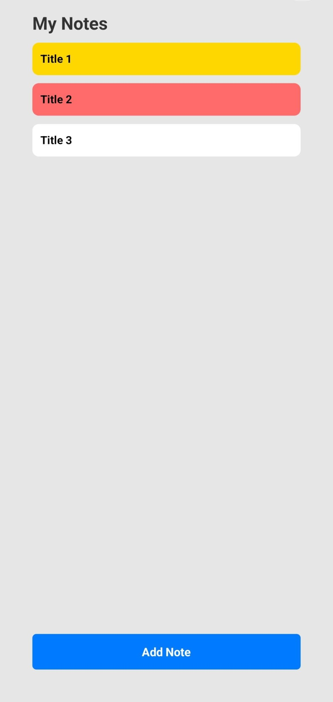

# Mobile Test Automation Using Robot Framework and Appium
## Introduction

TakeNoteAd is created for testing purposes, it is simple note-taking mobile application that allows users to create, view, and manage notes on Android devices. The app features:
1. email-based authentication: only checks if the email is in a valid email format (like example@domain.com) and allows access if it passes this validation. If the email format is incorrect or missing required elements, the app displays an error popup message to the user. No actual server-side authentication or password verification is performed as this is a test application focused on UI interaction patterns.
2. note creation with titles and content, categorization options, and note deletion functionality.

<div align="center">
  <table>
    <tr>
      <td align="center"><br/><sub>Login Screen</sub></td>
      <td align="center"><br/><sub>Main Screen</sub></td>
      <td align="center"><br/><sub>Note Creation</sub></td>
    </tr>
  </table>
</div>

This repository contains automated tests built with Robot Framework and Appium to verify the app's core functionality, including login flows, note creation, and note deletion.

## Table of Contents
- [Prerequisites](#prerequisites)
- [Setup for the test](#setup-for-the-test)
- [Conducting Tests](#conducting-tests)
- [Test Automation Architecture](#test-automation-architecture)

## Prerequisites

- Python:
  - robotframework==7.3.2
  - robotframework-appiumlibrary
  - robotframework-datadriver
  - python-dotenv
  - Appium-Python-Client
- Appium
  - uiautomator2 driver
- For the android device:
  - adb
  - either an android device or android emulator(you can use android studio)

## Setup for the test

### 1. Python setup
```
pip install -r requirements.txt
``` 

### 2. Device setup

#### a. Using physical android device
1. Install the apk from repository, or use your own app.
2. Install adb, you can find the information [here](https://developer.android.com/tools/adb)
3. Connect your android device to computer via USB, you need to enable USB debugging in developer options. To enable developer options follow the [instructions](https://developer.android.com/studio/debug/dev-options)

#### b. Using Android Studio Emulator

1. Download and install Android Studio from the official website. Follow the installation wizard and make sure to install the Android SDK during setup.
2. You can create emulator by opening AVD Manager in Android Studio. Click on "Tools > AVD Manager" or the AVD Manager icon in the toolbar, then select "Create Virtual Device" and follow the wizard to choose a device definition, system image, and configuration settings
3. You can start emulator from within Android Studio or command line. In Android Studio, open AVD Manager and click the play button next to your emulator. 

### 3. Configuring the test automation
1. Using adb cli, list the connected devices:
```
adb devices
```
2. You can find your device name, change the 'ANDROID_DEVICE_NAME' from config file [.env](configs/.env)

3. If you are using the apk in this repo, leave other fields unchanged. If you want to write your own tests for another app, you can find the 'ANDROID_APP_PACKAGE' and ,'ANDROID_ACTIVITY_NAME' by using Apk Info app.

### 4. Appium Server Setup

1. Install Node.js and npm:
   - Download and install Node.js from [nodejs.org](https://nodejs.org/en/download/) which includes npm
   - Verify installation with `node --version` and `npm --version`

2. Install Appium and UIAutomator2 driver:
   - Option 1 (Global installation): 
     ```
     npm install -g appium
     appium driver install uiautomator2
     ```
   - Option 2 (Project installation): 
     ```
     npm install
     ```
     This installs Appium and UIAutomator2 driver as specified in package.json

3. Starting the Appium server:
   - For global installation: Run `appium` in your terminal
   - For project installation: Run `npx appium` in your terminal
   - Keep this terminal window open while running tests

## Conducting Tests

You can run all the tests using
```
robot -d output/ tests/
```

Using tags you can specify the specific tests, the tags are: login, createNote, mainPage, dataDriver, OpenApplication, positive, negative. For example:

```
robot --include login tests/
```

## Test Automation Architecture

- config: keeps the .env, you can change here to use other apps and new devices
- data: keeps .csv files to be used by DataDriver driver.
- resources: keeps the helper keywords and variables that test cases will use:
  - base: common keywords are defined here. The keywords being used across project, e.g. Click Element When Visible
  - locators: page based locators, seperate locator robot file for each app page.
  - pages: atomic operations per page, e.g Press Add Note Button for MainPage.robot
  - keywords: complex keywords using the atomic operations from pages, e.g. Login keyword uses Input User Email and Submit Login
  - libs: Python scripts that is used in test automation. We used an environment variable loader script.
- tests: contains Robot Framework test cases that use resources, locators, and keywords. Each .robot file represents a logical test scenario (e.g., login, create note, delete note).

## Test Output

After running tests, reports are generated in the `output/` directory, you can find the all tests result:

- `report.html` – High-level summary of test results: [report](output/report.html)
- `log.html` – Detailed step-by-step execution logs: [log](output/log.html)